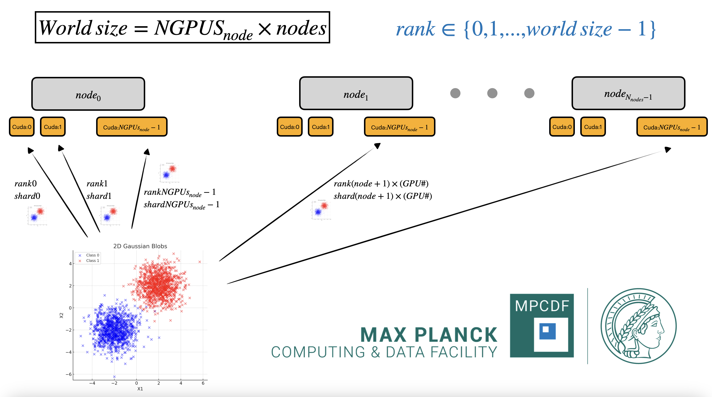

# multiNodeGpus_example
Example for running multi-Gpus training across multiple nodes on the MPCDF cluster

## Installation

```bash
git clone https://github.com/mvigl/multiNodeGpus_example.git

pip install -e .
```

## Usage
After chnaging the paths in the slurm config from `/raven/u/mvigl/multiNodeGpus_example` to `/raven/u/<user>/path/to/multiNodeGpus_example`, from the `MPCDF` cluster run:

```bash
bash slurm/submit_jobs.sh
```